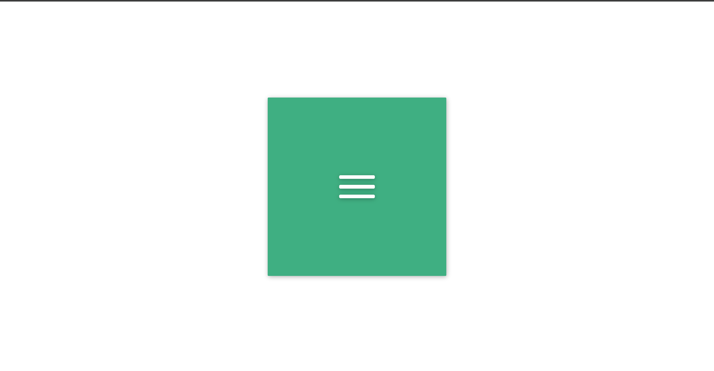
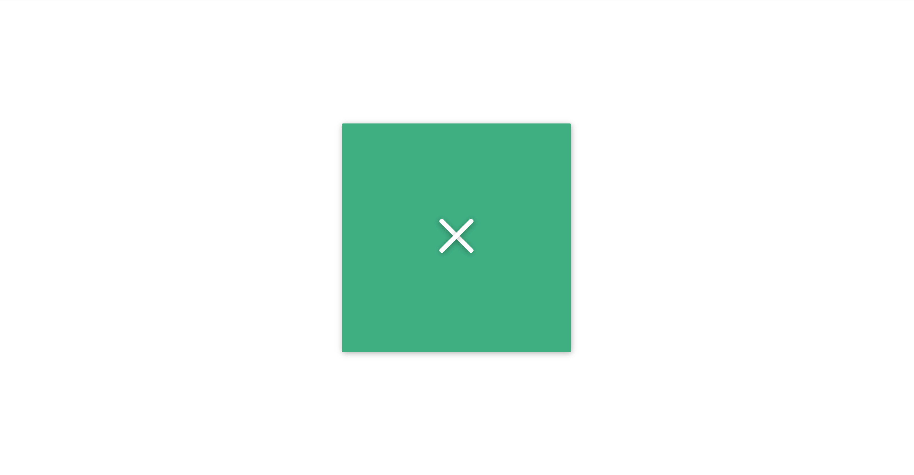

<h1>Menu Icon Toggle Animation</h1>

This project demonstrates a simple animated menu icon that toggles between a hamburger menu and a close icon when clicked. The animation and functionality are implemented using HTML, CSS, and vanilla JavaScript.

<h2>Table of Contents</h2>
<ul>
    <li><a href="#project-overview">Project Overview</a></li>
    <li><a href="#getting-started">Getting Started</a></li>
    <li><a href="#project-structure">Project Structure</a></li>
    <li><a href="#preview">Preview</a></li>
    <li><a href="#customization">Customization</a></li>
    <li><a href="#usage">Usage</a></li>
    <li><a href="#contributing">Contributing</a></li>
    <li><a href="#credits">Credits</a></li>
    <li><a href="#license">License</a></li>
    <li><a href="#contact">Contact Information</a></li>
</ul>

<h2 id="project-overview">Project Overview</h2>

The main objective of this project is to create an animated menu icon that transforms from a hamburger menu to a close (X) icon when clicked. This is a common user interface pattern used in web applications to toggle the visibility of a navigation menu.

<h2 id="getting-started">Getting Started</h2>

To get started with this project, you can clone the repository or download the project files directly. No additional dependencies or frameworks are required as the project uses vanilla JavaScript, HTML, and CSS.

<h3>Prerequisites</h3>
<ul>
    <li>Basic knowledge of HTML, CSS, and JavaScript.</li>
    <li>A modern web browser (Chrome, Firefox, Safari, Edge).</li>
</ul>

<h3>Installation</h3>
<ol>
    <li><strong>Clone the repository:</strong>
        <pre><code>git clone https://github.com/Yashi-Singh-1/Day-02-Menu-Icon.git
cd menu-icon-toggle
</code></pre>
    </li>
    <li><strong>Open the project:</strong>
        
Open the <code>index.html</code> file in your preferred web browser to see the menu icon animation in action.

    </li>
</ol>

<h2 id="project-structure">Project Structure</h2>

The project consists of the following files:

<ul>
    <li><code>index.html</code>: Contains the HTML structure.</li>
    <li><code>styles.css</code>: Contains the CSS styles for the menu icon and its animations.</li>
    <li><code>script.js</code>: Contains the JavaScript code for toggling the menu icon.</li>
</ul>

<h2 id="preview">Preview</h2>

Here is a preview of the animated menu icon:

<h2 id="customization">Customization</h2>

You can customize the appearance and behavior of the menu icon by adjusting the CSS styles:

<ul>
    <li><strong>Color:</strong> Change the background color of the lines.</li>
    <li><strong>Size:</strong> Adjust the dimensions of the icon and the lines.</li>
    <li><strong>Animation:</strong> Modify the transform and transition properties to change the animation effects.</li>
</ul>

<h2 id="usage">Usage</h2>

To use the menu icon in your own project, follow these steps:

<ol>
    <li><strong>Include the HTML structure</strong> for the menu icon in your web page.</li>
    <li><strong>Link the CSS and JavaScript files</strong> in your HTML document or copy the relevant styles and scripts into your existing files.</li>
    <li><strong>Customize the styles and behavior</strong> as needed to fit your design requirements.</li>
</ol>

<h2 id="contributing">Contributing</h2>

Contributions are welcome! If you have any suggestions or improvements, please submit a pull request or open an issue.

<h3>How to Contribute</h3>
<ol>
    <li>Fork the repository.</li>
    <li>Create a new branch: <code>git checkout -b feature/your-feature-name</code></li>
    <li>Make your changes and commit them: <code>git commit -m 'Add some feature'</code></li>
    <li>Push to the branch: <code>git push origin feature/your-feature-name</code></li>
    <li>Open a pull request.</li>
</ol>

<h2 id="credits">Credits</h2>

This project is inspired by the animated menu icon example from <a href="https://100dayscss.com/days/2/" target="_blank">100 Days CSS</a>.

<h2 id="license">License</h2>

This project is licensed under the MIT <a href="https://github.com/Yashi-Singh-1/Day-1-CSS-Challenge?tab=MIT-1-ov-file](https://github.com/Yashi-Singh-1/Day-02-Menu-Icon?tab=MIT-1-ov-file">License</a>. You are free to use, modify, and distribute this project as you see fit.

<h2 id="contact">Contact Information</h2>

If you have any questions or feedback, feel free to contact me:

<ul>
    <li><strong>LinkedIn:</strong> Yashi Singh (www.linkedin.com/in/yashi-singh-b4143a246)</li>
    <li><strong>GitHub:</strong> <a href="https://github.com/Yashi-Singh-1" target="_blank">Yashi Singh</a></li>
</ul>
